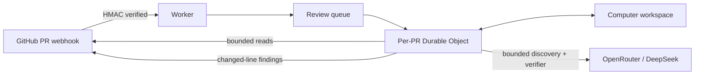

<p align="center">
  
</p>

<h1 align="center">Gaston</h1>

<p align="center">
  A frugal, high-precision AI reviewer that catches bugs before your users do.
</p>

<p align="center">
  <a href="LICENSE"></a>
  
  
</p>

Gaston automatically reviews pull requests with a custom TypeScript agent
harness running entirely on Cloudflare Workers. It uses
[Cloudflare Computer](https://github.com/cloudflare/computer) as a durable
SQLite-backed workspace and calls
[`deepseek/deepseek-v4-flash-0731`](https://openrouter.ai/deepseek/deepseek-v4-flash-0731)
through OpenRouter.

There are no containers, Docker images, shells, or dynamically executed PRs.

## What makes it useful

- **Automatic:** reviews new, reopened, updated, and ready-for-review PRs.
- **Interruptible:** a new commit stops stale in-flight work and immediately
  starts a cumulative review of the latest PR head.
- **On demand:** repository owners, members, and collaborators can comment
  `@gaston` or `@gaston review` on a pull request; Gaston immediately reacts
  with 👀 when the command has been accepted.
- **Cumulative:** every new head is reviewed from the base commit, so the review
  covers all commits currently in the pull request.
- **Deep and low-noise:** one bounded discovery pass targets the riskiest
  behavior, security, state, and operations paths; an independent verifier runs
  only when a changed-line candidate survives discovery.
- **Repository aware:** reads relevant files and searches code at the exact
  base or head commit instead of reasoning from an isolated diff.
- **Safe by construction:** exposes bounded read-only tools; PR code is never
  executed and the model never receives GitHub or OpenRouter credentials.
- **Frugal:** uses a serverless Worker, queues, per-PR Durable Objects, and an
  inexpensive model without paying for idle containers.

## How it works



The Worker verifies GitHub's HMAC signature before accepting a job. A queue
moves inference off the webhook request, while one Durable Object per pull
request prevents duplicate reviews and supersedes stale in-flight work when a
new head arrives. Computer caches the evidence the agent reads without cloning
or executing the repository.

The discovery agent can list changed files, inspect patches, list repository
paths, read bounded file slices, and perform literal code searches. It receives
one evidence turn with at most four parallel reads, then a tool-disabled final
turn. Only a truncated or invalid tool result unlocks one targeted recovery
turn with at most two calls. An independent verifier runs only when discovery produced candidates.
DeepSeek reasoning state—including meaningful empty reasoning—is preserved
across tool calls. Exact reads are memoized, prompts are capped at 72 KB, tool
results retain marked head/tail previews, and history is compacted to a 120 KB
carried-context target. Immutable trees and files are cached by commit SHA
across new PR heads, while per-run context is cleared independently.
A shared four-minute/request/token/cost budget covers every phase and retry.
Deterministic code then drops weak findings, invalid line anchors, stale-head
results, and anything over the configured finding cap.

Tool responses carry typed `ok`, `truncated`, `invalid_arguments`,
`permanent_error`, or `transient_error` outcomes. Gaston publishes a successful
clean check only when evidence coverage is sufficient; incomplete evidence ends
neutral and lists its limitations. The latest requested head, execution
generation, check run, and phase are persisted before work proceeds, so a
Durable Object restart cannot make an older execution current again.

Every accepted head gets a queued check immediately. If a newer commit arrives,
Gaston aborts the older head's model request, retry delay, and in-flight GitHub
evidence reads, marks that check superseded, and reviews the full cumulative PR
diff at the new head. Transient queue failures reuse the same check; exhausted
deliveries are retained in a dead-letter queue.

## Quick start

You need a Cloudflare Workers paid plan, a GitHub organization, an OpenRouter
API key, Bun, and Wrangler authentication.

```bash
bun install
bunx wrangler whoami
bunx wrangler queues create gaston-reviews
bunx wrangler queues create gaston-reviews-dlq
bun run check
bun run deploy
```

Then register the GitHub App and install its secrets:

```bash
node tools/setup-github-app.mjs \
  --worker-url https://YOUR-WORKER.YOUR-SUBDOMAIN.workers.dev \
  --organization YOUR_ORGANIZATION

bunx wrangler secret put OPENROUTER_API_KEY
```

The setup helper stores the GitHub App ID, private key, and webhook secret
directly in Cloudflare. See the [step-by-step setup guide](docs/setup.md) for
permissions, installation, verification, and troubleshooting.

## Configuration

| Variable | Default | Purpose |
| --- | --- | --- |
| `REVIEW_MODEL` | `deepseek/deepseek-v4-flash-0731` | Exact OpenRouter model |
| `REVIEW_REASONING_EFFORT` | `high` | Fixed review effort; Gaston rejects lower values rather than silently downgrading reasoning |
| `REVIEW_MIN_CONFIDENCE` | `0.82` | Minimum confidence for published findings |
| `REVIEW_MAX_FINDINGS` | `8` | Maximum inline findings per review |
| `REQUEST_CHANGES_ON` | `blocker` | `off`, `blocker`, or `high` |
| `REVIEW_MAX_WALL_TIME_MS` | `240000` | Aggregate review wall-clock limit |
| `REVIEW_MODEL_TIMEOUT_MS` | `120000` | Timeout for one provider attempt |
| `REVIEW_MAX_MODEL_REQUESTS` | `6` | Aggregate provider-attempt limit |
| `REVIEW_MAX_INPUT_TOKENS` | `250000` | Approximate aggregate input-token limit |
| `REVIEW_MAX_OUTPUT_TOKENS` | `48000` | Reported aggregate output-token limit |
| `REVIEW_MAX_COST_USD` | `0.20` | Reported aggregate OpenRouter cost limit |

Add repository-specific guidance in `.gaston/review.md`. Gaston also reuses
root `AGENTS.md`, `.github/copilot-instructions.md`, and `CLAUDE.md` when they
already exist, plus `AGENTS.md` files in directories containing changed code.
All policy is read from the base commit, so a pull request cannot weaken the
rules reviewing it.

## Security and cost controls

The public Worker URL is not an inference API. Only a correctly signed GitHub
webhook can enqueue a review; all other routes return `404`, and invalid webhook
requests are rejected before OpenRouter is called. The OpenRouter key is stored
as an encrypted Cloudflare secret and appears only in the outbound authorization
header.

Structured Worker logs report each review phase and model attempt, including the
requested and returned model, provider, elapsed time, request size, tool names,
executed/cached calls, context compaction, checkpoint reuse, token/cache/reasoning
usage, reported OpenRouter cost, and remaining budget. GitHub check progress and
the terminal summary also show aggregate resource use. Logs never contain
credentials, prompts, model output, tool arguments, or repository contents.

For public repositories, outside contributors can still trigger legitimate
reviews by opening or updating pull requests. Set a weekly OpenRouter key limit,
restrict the GitHub App to selected repositories, or add an author allowlist if
you need a stricter spending boundary.

## Why no container?

A CLI coding agent normally needs a Linux process, shell, and repository clone.
Gaston implements the useful tool loop directly in the Worker and runs Computer
in filesystem-only mode. A container would add startup time, image maintenance,
attack surface, and idle-cost concerns without adding a capability this design
needs.

## Development

```bash
bun run typecheck
bun run test
bun run eval:historical
bun run eval:harness
bunx wrangler dev
bunx wrangler deploy --dry-run
bun run diagnose:pr -- OWNER/REPOSITORY#123
```

`eval:harness` replays synthetic provider/tool trajectories and gates precision,
recall, model requests, tool calls, and cost. Real-repository historical corpora
are private local artifacts: capture one with `bun run fixtures:capture --
owner/repo 25`, then run it with
`GASTON_HISTORICAL_CORPUS=.private/evals/owner-repo-historical-prs.json bun run
eval:historical`. The entire `.private/` tree is Git-ignored; never commit
repository snapshots, titles, URLs, commit IDs, or human labels from private
repositories.

`bun run check:privacy` fails CI if a private eval directory or historical PR
snapshot is tracked, providing a second guard beyond `.gitignore`.

The research behind the low-noise review strategy is documented in
[docs/research.md](docs/research.md); the exhaustive competitor review is in
[docs/deep-research.md](docs/deep-research.md), and the OpenCode V2 harness
investigation is in [docs/harness-research.md](docs/harness-research.md).

## Current limitations

- Gaston does not run untrusted PR code, tests, linters, or extensions.
- GitHub omits patches for binaries and some oversized changes; Gaston reports
  neutral, incomplete coverage instead of inventing findings or asserting the
  change is clean.
- Cloudflare Computer is preview software. Version `0.1.1` is pinned and should
  be reviewed before upgrades or use as a required merge gate.
- AI review complements human review, tests, CodeQL, dependency scanning, and
  deterministic static analysis; it does not replace them.

## License

[MIT](LICENSE)
