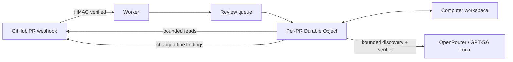

<p align="center">
  
</p>

<h1 align="center">Gaston</h1>

<p align="center">
  A frugal, precision-oriented AI reviewer that catches bugs before your users do.
</p>

<p align="center">
  <a href="LICENSE"></a>
  
  
</p>

Gaston automatically reviews pull requests with a custom TypeScript agent
harness running entirely on Cloudflare Workers. It uses
[Cloudflare Computer](https://github.com/cloudflare/computer) as a durable
SQLite-backed workspace and calls
[`openai/gpt-5.6-luna`](https://openrouter.ai/openai/gpt-5.6-luna)
through OpenRouter. The measured default pins Luna's OpenAI route and uses its
`max_tokens` wire contract. Provider data collection remains denied; strict
[zero-data retention](https://openrouter.ai/docs/guides/features/zdr) is an
explicit opt-in for repositories that need it.

There are no containers, Docker images, shells, or dynamically executed PRs.

## What makes it useful

- **Automatic:** reviews new, reopened, updated, and ready-for-review PRs.
- **Interruptible:** a new commit stops stale in-flight work and supersedes it
  with a cumulative review of the latest PR head.
- **On demand:** repository owners, members, and collaborators can comment
  `@gaston` or `@gaston review` on a pull request; Gaston immediately reacts
  with 👀 when the command has been accepted.
- **Cumulative:** every new head is reviewed from the base commit, so the review
  covers all commits currently in the pull request.
- **Paginated inventory:** Gaston paginates GitHub's cumulative pull-request file
  endpoint through its documented 3,000-file ceiling. Large inventories remain
  page-accessible to the agent, and omitted patches or an API-capped listing are
  reported as incomplete evidence rather than a clean review.
- **Deep and low-noise:** one bounded discovery pass targets the riskiest
  behavior, security, state, and operations paths; a separate cold same-model
  verifier returns an explicit `confirmed`, `refuted`, or `insufficient`
  verdict for every changed-line candidate.
- **Repository aware:** reads relevant files and searches code at the exact
  base or head commit instead of reasoning from an isolated diff.
- **Safe by construction:** exposes bounded read-only tools; PR code is never
  executed and the model never receives GitHub or OpenRouter credentials.
- **Frugal:** uses a serverless Worker, queues, per-PR Durable Objects, and an
  inexpensive model without paying for idle containers.

## How it works



The Worker verifies GitHub's HMAC signature before accepting a job. A queue
moves inference off the webhook request, while one Durable Object per pull
request prevents duplicate reviews and supersedes stale in-flight work when a
new head arrives. Computer caches the evidence the agent reads without cloning
or executing the repository.

The discovery agent can list changed files, inspect bounded patch slices, list repository
paths, read bounded file slices, and perform literal code searches. It receives
one evidence turn with at most four parallel reads, then a tool-disabled final
turn. A truncated or invalid result, an exact-patch coverage shortfall, or an
inventory-only first batch can unlock a targeted recovery batch with at most
two calls. Only a new uncovered exact-patch continuation can unlock one final
patch-only batch; the phase-wide ceiling is eight evidence calls. Inventory
recovery is patch-only and restricted to paths just
returned by GitHub. Once the bounded target of exact patches is met,
intentional prompt shortening no longer makes coverage incomplete; an actually
truncated GitHub changed-file listing still does. Oversized per-file patches
return patch-line continuation metadata, and exact intervals are unioned before
a file counts as fully inspected. A separate cold same-model verifier runs only
when discovery produced candidates. Candidate IDs, exact anchors, and opaque
`GASTON-EVIDENCE-N` handles are harness-owned, so the model never has to retype
a path-shaped evidence identity. A conclusive verdict is accepted only when
every cited handle is complete in the verifier's phase-local ledger; a complete
narrow read may supersede its earlier broad truncated read of the same file.
Discovery reads cannot masquerade as independent verification. Omitted,
malformed, invented, or still-incomplete evidence fails closed as
`insufficient`, never as a silent veto, and any unresolved candidate keeps the
terminal GitHub check neutral rather than green.
Provider reasoning state—including meaningful empty DeepSeek reasoning—is preserved
across tool calls. Exact reads are memoized, prompts are capped at 72 KB, tool
results are capped at 12 KB, and history is compacted to a 120 KB carried-context
target. Structured inventory and patch results remain valid JSON with exact
continuation metadata; bounded prose/file results use marked head/tail previews.
When the initial cumulative diff exceeds its 40 KB prompt allowance, Gaston
stratifies that allowance across changed hunks instead of deleting the global
middle, so a middle file or middle hunk cannot disappear from initial review.
Immutable trees and files are cached by commit SHA
across new PR heads, while per-run context is cleared independently.
A shared fourteen-minute/request/token/cost budget covers every phase, provider
attempt, and queue redelivery. Resource usage is persisted before provider work
leaves the Durable Object; queue backoff does not count as active review time.
Deterministic code then drops weak findings, invalid line anchors, stale-head
results, and anything over the configured finding cap.

Tool responses carry typed `ok`, `truncated`, `invalid_arguments`,
`permanent_error`, or `transient_error` outcomes. Gaston publishes a successful
clean check only when evidence coverage is sufficient; incomplete evidence ends
neutral and lists its limitations. The latest requested head, execution
generation, check run, and phase are persisted before work proceeds, so a
Durable Object restart cannot make an older execution current again.

Every accepted head gets a queued check immediately. If a newer commit arrives,
Gaston aborts the older head's model request, retry delay, and in-flight GitHub
evidence reads, marks that check superseded, and reviews the full cumulative PR
diff at the new head. Transient queue failures reuse the same check and remaining
budget; exhausted deliveries are retained in a dead-letter queue.

## Quick start

You need a Cloudflare Workers paid plan, a GitHub personal account or
organization that can install an App, an OpenRouter API key, Bun, and Wrangler
authentication.

```bash
bun install
bunx wrangler whoami
bunx wrangler queues create gaston-reviews
bunx wrangler queues create gaston-reviews-dlq
bun run check
bun run deploy
```

Then register the GitHub App and install its secrets:

```bash
node tools/setup-github-app.mjs \
  --worker-url https://YOUR-WORKER.YOUR-SUBDOMAIN.workers.dev \
  --organization YOUR_ORGANIZATION

bunx wrangler secret put OPENROUTER_API_KEY
bunx wrangler secret put DASHBOARD_TOKEN
```

The setup helper stores the GitHub App ID, private key, and webhook secret
directly in Cloudflare. See the [step-by-step setup guide](docs/setup.md) for
permissions, installation, verification, and troubleshooting.

## Configuration

| Variable | Default | Purpose |
| --- | --- | --- |
| `DASHBOARD_TOKEN` | — | Required bearer token for the live per-PR review workspace; when unset, the API stays hidden behind `404` |
| `DASHBOARD_URL` | Worker URL | Public dashboard origin used by GitHub check-run **Details** links; incoming webhooks override it with their own origin |
| `REVIEW_MODEL` | `openai/gpt-5.6-luna` | Reasoning/tool-capable OpenRouter model; the live fresh-PR screen favored Luna over DeepSeek V4 Flash and V4 Pro. Alternate model and provider pairs must pass the provider-conformance tests before deployment |
| `REVIEW_PROVIDER` | `openai` | OpenRouter provider slug pinned for production requests. The wire contract follows the provider: Azure uses `max_completion_tokens`; every other route uses `max_tokens` |
| `REVIEW_REQUIRE_ZDR` | `false` | Set to `true` with `REVIEW_PROVIDER=azure` for Luna zero-data retention. The incompatible OpenAI+ZDR pair fails before inference. `data_collection: deny` is sent regardless |
| `REVIEW_REASONING_EFFORT` | `max` | `high`, `xhigh`, or `max`; the fresh Luna effort comparison favored `max`, and lower tiers are rejected rather than silently downgrading reasoning |
| `REVIEW_MODEL_MAX_OUTPUT_TOKENS` | `64000` | Per-attempt completion ceiling; normal requests start at 32,000 and a true length exhaustion can use this ceiling |
| `REVIEW_DIRECT_DISCOVERY` | `true` | Use one structured, tool-free issue-list pass when the complete changed code already fits the prompt; automatically retain bounded repository retrieval when evidence is incomplete |
| `REVIEW_REQUIRE_INITIAL_TOOL_CALL` | `false` | Require at least one repository evidence call before accepting a model verdict |
| `REVIEW_MAX_EXPLORATION_TURNS` | `1` | One broad evidence turn, or `2` for one additional candidate-targeted confirmation turn |
| `REVIEW_MIN_CONFIDENCE` | `0.80` | Minimum confidence for each independently verified, candidate-bound finding; unrelated incomplete candidates do not raise it |
| `REVIEW_INCOMPLETE_EVIDENCE_MIN_CONFIDENCE` | `0.88` | Aggregate incomplete-evidence fallback retained for non-candidate policy checks; an unresolved verifier candidate is withheld instead of raising other candidates' thresholds |
| `REVIEW_MAX_FINDINGS` | `8` | Maximum inline findings per review |
| `REQUEST_CHANGES_ON` | `blocker` | `off`, `blocker`, or `high` |
| `REVIEW_MAX_WALL_TIME_MS` | `840000` | Aggregate active-review wall-clock limit; queue backoff is excluded |
| `REVIEW_MODEL_TIMEOUT_MS` | `660000` | Timeout for one provider attempt |
| `REVIEW_MAX_MODEL_REQUESTS` | `9` | Aggregate provider-attempt limit |
| `REVIEW_MAX_INPUT_TOKENS` | `250000` | Approximate aggregate input-token limit |
| `REVIEW_MAX_OUTPUT_TOKENS` | `128000` | Reported aggregate output-token limit |
| `REVIEW_MAX_COST_USD` | `0.20` | Reported aggregate OpenRouter cost limit |

Add repository-specific guidance in `.gaston/review.md`. Gaston also reuses
root `AGENTS.md`, `.github/copilot-instructions.md`, and `CLAUDE.md` when they
already exist, plus `AGENTS.md` files in directories containing changed code.
All policy is read from the base commit, so a pull request cannot weaken the
rules reviewing it.

## Security and cost controls

The public Worker URL is not an inference API. Only a correctly signed GitHub
webhook can enqueue a review. The live review API is read-only and requires the
`DASHBOARD_TOKEN` bearer secret; it returns `404` when the secret is not
configured and `401` for an invalid token. Invalid webhook requests are rejected
before OpenRouter is called. Secrets are stored by Cloudflare and never bundled
into the browser application.

The default OpenAI route is not marked ZDR and is used for both public and
private repositories. For deployments that independently require strict zero
retention, set `REVIEW_PROVIDER=azure` and `REVIEW_REQUIRE_ZDR=true`; Gaston
then switches to Azure's `max_completion_tokens` request field and keeps that
provider/privacy profile across retries. Invalid provider slugs and boolean
settings fail before inference.

Structured Worker logs report each review phase and model attempt, including the
requested and returned model, provider, elapsed time, request size, tool names,
executed/cached calls, context compaction, checkpoint reuse, token/cache/reasoning
usage, reported OpenRouter cost, and remaining budget. GitHub check progress and
the terminal summary also show aggregate resource use. Logs never contain
credentials, prompts, model output, tool arguments, or repository contents.

For public repositories, outside contributors can still trigger legitimate
reviews by opening or updating pull requests. Set a weekly OpenRouter key limit,
restrict the GitHub App to selected repositories, or add an author allowlist if
you need a stricter spending boundary.

## Why no container?

A CLI coding agent normally needs a Linux process, shell, and repository clone.
Gaston implements the useful tool loop directly in the Worker and runs Computer
in filesystem-only mode. A container would add startup time, image maintenance,
attack surface, and idle-cost concerns without adding a capability this design
needs.

## Development

```bash
bun run typecheck
bun run test
bun run eval:historical
bun run eval:harness
bun run eval:models
bunx wrangler dev
bunx wrangler deploy --dry-run
bun run diagnose:pr -- OWNER/REPOSITORY#123
```

For local full-stack development, run `bun run dev` and `bun run dev:ui` in
separate terminals. Vite proxies `/api` to the local Worker. Open the UI, enter
an `owner/repository`, pull request number, and the dashboard token. The token is
kept in `sessionStorage`; it is not written to the URL or persisted in the
Worker. A session appears after that pull request has started a review on this
version of Gaston. Gaston's GitHub check run uses its native **Details** link to
open this workspace with the repository and pull request already selected; the
dashboard token is never included in that link.

`eval:harness` is a deterministic protocol regression: it replays scripted
provider/tool trajectories and gates parsing, request counts, tool counts, and
cost accounting. Its scripted precision/recall numbers do **not** measure model
quality. `eval:historical` validates the shape of a private PR manifest when
`GASTON_HISTORICAL_CORPUS` is set and otherwise reports a skip; it does not fetch
diffs, execute the model, or adjudicate findings. Real quality
experiments need immutable base/head snapshots, hidden semantic labels, paired
clean controls, and executable or human-adjudicated oracles. Private manifests
can be captured with `bun run fixtures:capture -- owner/repo 25`, then checked
with
`GASTON_HISTORICAL_CORPUS=.private/evals/owner-repo-historical-prs.json bun run
eval:historical`. The entire `.private/` tree is Git-ignored; never commit
repository snapshots, titles, URLs, commit IDs, human labels, or model outputs
from private repositories.

`eval:models` validates the public exact-SHA recent-bot corpus without spending
model tokens. Pass `--run` and explicit model, provider, effort, output mode,
cost cap, and ignored output path to execute a paid arm. The DeepSeek Cloud
route requires the explicit data-collection opt-in; provider pinning prevents
fallback to GMICloud or another endpoint.

```bash
bun run eval:models --run \
  --model openai/gpt-5.6-luna --provider openai --effort max \
  --structured-output json_object --max-cost-usd 0.25 \
  --output .private/evals/recent-bot-prs/luna.json

bun run eval:models --run \
  --model deepseek/deepseek-v4-pro-0813 --provider deepseek --effort xhigh \
  --structured-output json_object --allow-data-collection \
  --max-cost-usd 0.25 \
  --output .private/evals/recent-bot-prs/deepseek.json
```

`bun run check:privacy` fails CI if a private eval directory or historical PR
snapshot is tracked, providing a second guard beyond `.gitignore`.

The research behind the low-noise review strategy is documented in
[docs/research.md](docs/research.md); the exhaustive competitor review is in
[docs/deep-research.md](docs/deep-research.md), the historical OpenCode harness
investigation is in [docs/harness-research.md](docs/harness-research.md), and
the current OpenCode V2/DeepSeek reliability follow-up is in
[docs/harness-v2-research.md](docs/harness-v2-research.md). The latest
leakage-resistant evaluation, fresh-PR corpus and diagnostic runs, and
directional configuration A/B are in
[docs/harness-v3-research.md](docs/harness-v3-research.md).

## Current limitations

- Gaston does not run untrusted PR code, tests, linters, or extensions.
- GitHub omits patches for binaries and some oversized changes; Gaston reports
  neutral, incomplete coverage instead of inventing findings or asserting the
  change is clean.
- Cloudflare Computer is preview software. Version `0.1.1` is pinned and should
  be reviewed before upgrades or use as a required merge gate.
- AI review complements human review, tests, CodeQL, dependency scanning, and
  deterministic static analysis; it does not replace them.

## License

[MIT](LICENSE)
